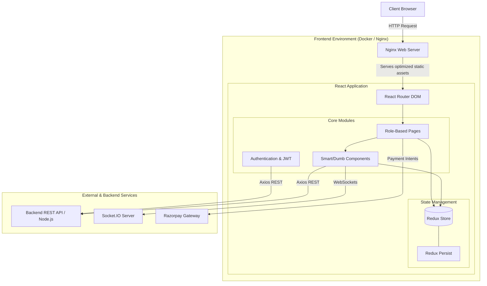

<div align="center">
  <h1>Milestone Freelance Platform</h1>
  <p>A comprehensive, modern React application connecting Freelancers and Employers.</p>
</div>

---

## Overview

**Milestone** is a full-featured freelance marketplace frontend built with React 19, Vite, and Tailwind CSS. It supports multiple user roles (Admin, Employer, Freelancer, Moderator) and features real-time chat, job postings, interactive maps, payment integrations, and rich dashboards.

## Key Features

- **Role-Based Access Control**: Tailored dashboards and routing for Admins, Employers, Freelancers, and Moderators.
- **Real-Time Communication**: Integrated `socket.io-client` for live chat and instant notifications.
- **Job Board & Applications**: Seamless job listing browsing, smart filtering, and application management.
- **Payment Integration**: Secure transaction flows utilizing Razorpay.
- **Interactive Maps & Analytics**: Geographical data visualization with React Leaflet and metric tracking with Recharts.
- **Robust Forms & Validation**: Built with Formik and Yup for seamless data entry.
- **State Management**: Redux Toolkit for global state and Redux Persist for local storage caching.
- **Production-Ready Dockerization**: Multi-stage Docker builds powered by an optimized Nginx configuration.

---

## Architecture

The application is built as a Single Page Application (SPA) utilizing a modern component-based architecture.



---

## Technology Stack

| Category | Technologies |
| :--- | :--- |
| **Core** | React 19, Vite, JavaScript (ES6+) |
| **State & Routing** | Redux Toolkit, Redux Persist, React Router DOM v7 |
| **Styling & UI** | Tailwind CSS v4, Lucide React |
| **Network & Real-time** | Axios, Socket.io-client |
| **Forms & Validation** | Formik, Yup |
| **Data Viz & Maps** | Recharts, React Leaflet |
| **Testing** | Vitest, React Testing Library, ESLint |
| **Deployment** | Docker, Nginx |

---

## Project Structure

```text
src/
├── assets/         # Static assets (images, icons)
├── components/     # Reusable UI components (Navbars, Modals, Smart Filters)
├── context/        # React Context providers
├── hooks/          # Custom React hooks
├── pages/          # Route-level components grouped by role (Admin, Employer, Freelancer...)
├── redux/          # Redux Toolkit slices, selectors, and store configuration
├── styles/         # Global styles and Tailwind configurations
└── utils/          # Helper functions, API constants, and formatters
```

---

## Environment Variables

The project uses a local `.env` file for development configuration.

```env
# Backend base URL compiled into the production frontend build
VITE_BACKEND_URL=http://localhost:9000

# Optional alias used in parts of the codebase
VITE_API_BASE_URL=http://localhost:9000
```

> [!NOTE]
> For Docker production builds, pass the backend URL using build arguments instead of `.env` files.

---

## Getting Started (Local Development)

### Prerequisites
- Node.js (v20+ recommended)
- npm or yarn

### Installation

1. **Clone the repository and install dependencies**:
   ```bash
   npm install
   ```

2. **Start the development server**:
   ```bash
   npm run dev
   ```
   The application will be available at `http://localhost:5173`.

3. **Running Tests**:
   ```bash
   npm run test          # Run Vitest
   npm run test:coverage # Generate coverage report
   ```

---

## Docker & Container Setup

This frontend is fully productionized. The Docker context aggressively excludes unnecessary files via `.dockerignore` for faster, cleaner image builds.

- **`Dockerfile`**: Multi-stage build (Node 20 builder + Nginx runtime).
- **`nginx.conf`**: SPA-safe routing (unknown routes fallback to `/index.html`) and aggressive static asset caching.

### Build and Run (Frontend Only)

**1. Build the image** (Injecting the API URL):
```bash
docker build -t milestone-frontend --build-arg VITE_BACKEND_URL=http://localhost:9000 .
```

**2. Run the container**:
```bash
docker run --rm -p 3000:80 milestone-frontend
```
Open `http://localhost:3000` in your browser.

---

## Full Stack Run

If you are running the backend in tandem:

```bash
cd ../m-backend
docker compose up -d --build
```

**Expected Services:**
- MongoDB: `27017`
- Backend API: `9000`
- Frontend: `3000`

---

## Troubleshooting

> [!WARNING]
> **Frontend loads, but API calls fail:**
> You likely built the Docker image with the wrong backend URL. Rebuild the frontend providing the correct `VITE_BACKEND_URL`.

> [!TIP]
> **Routes return 404 after refresh (Nginx):**
> Ensure the container is utilizing the included `nginx.conf`. It relies on SPA fallback routing:
> `try_files $uri $uri/ /index.html;`
